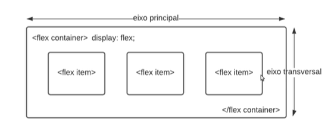

# FlexBox-CSS
Praticando com FlexBox 

A ferramenta Flexbox (de Flexible Box) foi criada para tornar essas tarefas mais simples e funcionais: os filhos de um elemento com Flexbox podem se posicionar em qualquer direção e pode ter dimensões flexíveis para se adaptar.

Elementos

O Flexbox é um módulo completo e não uma única propriedade; algumas delas devem ser declaradas no container (o elemento-pai, que chamamos de flex container), enquanto outras devem ser declaradas nos elementos-filhos (os flex itens).

Os ítens serão dispostos no leiaute seguindo ou o eixo principal ou o transversal.

Eixo principal: o eixo principal de um flex container é o eixo primário e ao longo dele são inseridos os flex items. Cuidado: O eixo principal não é necessariamente horizontal; vai depender da propriedade flex-direction (veja abaixo).

main-start | main-end: os flex items são inseridos dentro do container começando pelo lado start, indo em direção ao lado end.

Tamanho principal: A largura ou altura de um flex item, dependendo da direção do container, é o tamanho principal do ítem. A propriedade de tamanho principal de um flex item pode ser tanto width quanto height, dependendo de qual delas estiver na direção principal.

Eixo transversal: O eixo perpendicular ao eixo principal é chamado de eixo transversal. Sua direção depende da direção do eixo principal.

cross-start | cross-end: Linhas flex são preenchidas com ítens e adicionadas ao container, começando pelo lado cross start do flex container em direção ao lado cross end.

cross size: A largura ou altura de um flex item, dependendo do que estiver na dimensão transversal, é o cross size do íten. A propriedade cross size pode ser tanto a largura quanto a altura do ítem, o que estiver na transversal.

Referencia para mais informação: https://www.alura.com.br/artigos/css-guia-do-flexbox

Aprender jogando: https://flexboxfroggy.com/#pt-br

